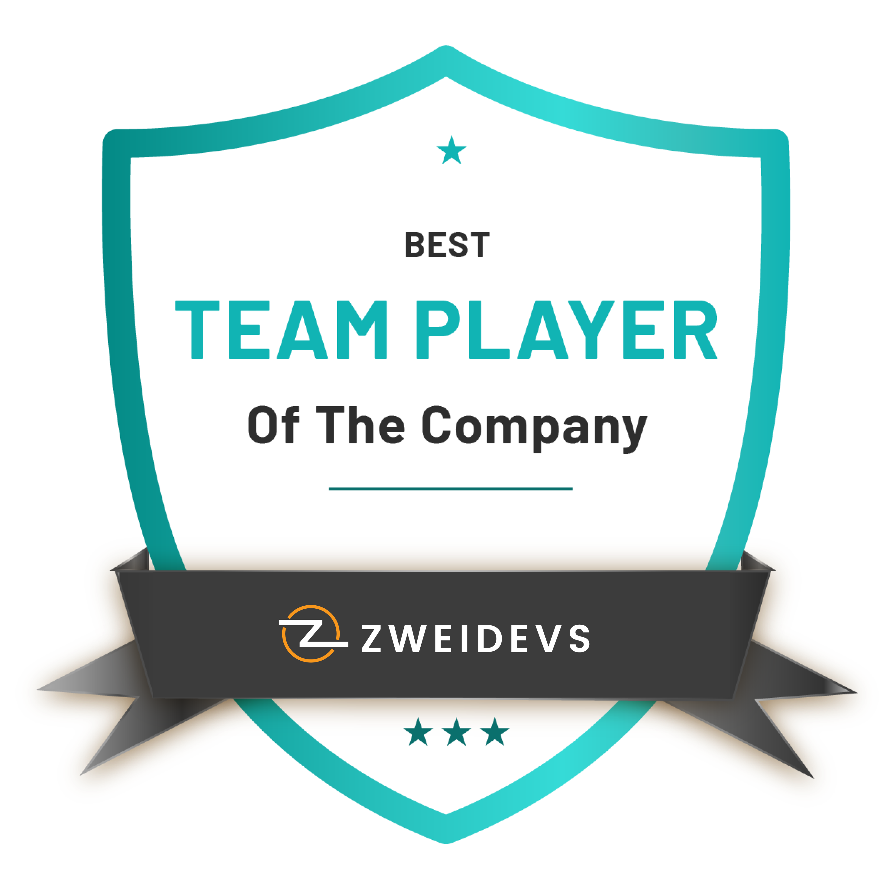

# Hi, I'm Syed Mudabbir Ali 👋

The world can be an overwhelming place, so I help make people’s lives easier by developing websites and applications as a software developer.

Let me tell you a bit about myself 

- 🖥️ I have been working for Zweidevs Private Limited as a Software Engineer.
- 🖨️ I have worked with Ruby on Rails, Ruby, PHP, and JavaScript, and databases including MS SQL, Firebase, MongoDB, and DynamoDB.
- 🧑‍💻 Besides having great skills, I believe learning must never end! I have learned many new skills such as Team Work, Management, and Relation Building.
- 🎾 In my free time, I am a gaming geek; I love to play PUBG Multiplayer and Story Mode Games.
- ⛰️ Love exploring off-beat hikes and peaks in Northern Pakistan. My absolute favorite: [Siri Paye Meadows](https://goo.gl/maps/zV3r6AYPzJPiWTPC9).
- 😄 Pronouns: He/him.

## 💻 GitHub Profile Stats

  
  

**Note:** Top languages is only a metric of the languages my public code consists of and doesn't reflect experience or skill level.

**Commit History:**

